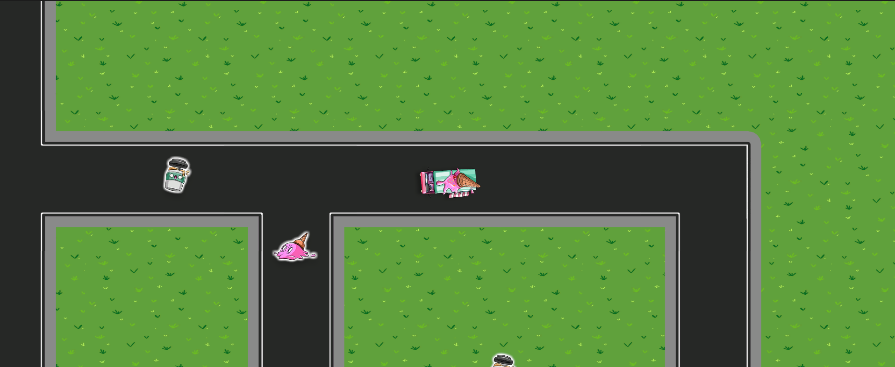
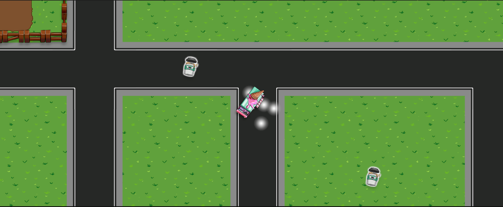
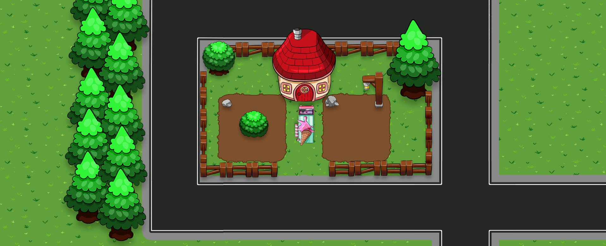

# 🚗 Delivery Dash (2D Unity Game)

A fast-paced 2D driving and delivery game built with **Unity**, where you race through city streets, dodge obstacles, and complete deliveries on time.  
Designed to explore **movement mechanics, collision handling, and game system design** in Unity.

---

### 🎮 Features
- 🚗 **Smooth driving and steering controls** using local-space rotation and translation
- 🧠 **Basic enemy/obstacle AI** and collision detection
- 🎯 **Delivery and scoring system** with increasing difficulty
- 🧩 **Level management** with collectibles and checkpoints
- 🕹️ **Main menu, restart, and pause systems**
---
### 🧰 Built With
- **Engine:** Unity 6
- **Language:** C#
- **Version Control:** Git & GitHub
---

### 🚀 How to Run

Follow these steps to run the game locally:

1. **Clone or download the repository**
   - **Clone via Git:**  
     ```bash
     git clone https://github.com/Adan-Assi/DeliveryDash-2D-Unity.git
     ```
   - **Or download ZIP:**  
     Click the green **Code** button on GitHub, then select **Download ZIP** and extract it to a folder on your computer.

2. **Open the project in Unity Hub**
   - Launch **Unity Hub**.
   - Click **Add** and navigate to the folder containing the project.
   - Select the folder and click **Open** to add it to your projects list.

3. **Open the project in the Unity Editor**
   - In Unity Hub, click the project to open it in the Unity Editor.
   - Wait for Unity to load all assets and packages.

4. **Run the game**
   - Click the **Play** button at the top of the Unity Editor.
   - The game will start in the Game view window.

> ⚠️ Make sure you have the compatible Unity version installed (Unity 6 or the version used to create this project) to avoid errors when opening the project.

---

### 🎥 Demo  

#### 🚀 Booster and Pickup Showcase  
  
*The player vehicle (the ice cream truck), a collectible item (ice cream) next to the coffee for a Caffeine boost.*

#### ✨ Pickup Effect  
  
*Particle system effect, triggered when picking up an ice cream.*

#### ⚡ Booster Speedup & Collision Demo  
[🎬 Watch Gameplay Video](Media/booster_collision_demo.mp4)  
*Shows the speed boost when hitting a booster, followed by a collision that resets the speed.*

#### 🏠 Delivery Scene  
  
*The ice cream truck delivering to a customer’s house, showing the delivery area design.*

> **Note:** The design is currently minimalistic and intended to evolve through future enhancements.

---

### 👨‍💻 Developed by Adan Assi
Built as a personal learning project to strengthen **Unity 2D development, C# scripting, and gameplay design fundamentals**. ✨
